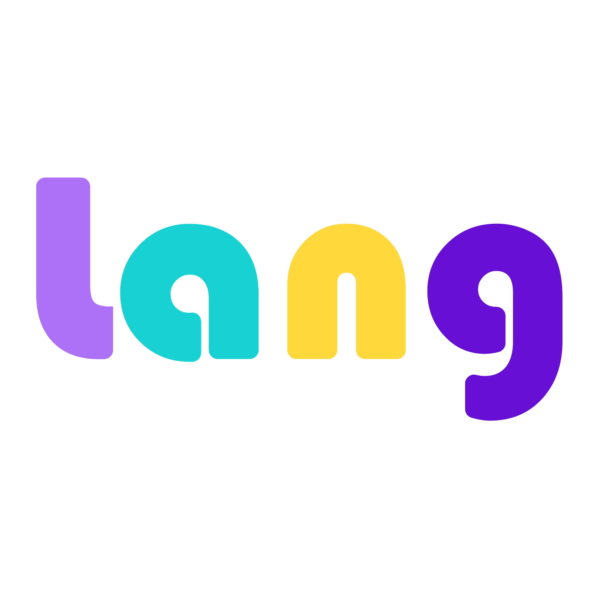

# Lang - Android

외국인과 내국인이 함께하는 글로벌 언어교환 & 모임 서비스 **Lang**입니다.

## # 개요

국내 체류 외국인이 증가하고 글로벌 비즈니스 사회에서의 외국어 능력의 중요도가 증가하고 있지만, 정작 우리는 소통을 위한 외국어 공부를 하고 있지 않습니다. 가장 좋은 외국어 학습 방법은 실제로 외국인과 대화를 통해서 자연스럽게 언어를 교환하는 것이지만, 내국인과 외국이느이 상호교류에 대한 정보와 플랫폼이 부족한 현실입니다. 이를 해결하기 위해서 Lang이라는 프로젝트에 참여해서 개발을 하게 되었습니다.

## # 워크플로우

## # Develop Environment

* Language - **Kotlin**, java
* Minimum SDK Version - 19
* Target SDK Version - 26
* Optimization Device - **Galaxy s6**

## # Library

1. **Layout**
* 'com.sothree.slidinguppanel:library:3.4.0'
* 'com.android.support:cardview-v7:26.+'
* 'com.android.support:recyclerview-v7:26.+'
* 'com.thoughtbot:expandablerecyclerview:1.3'
* 'com.zarinpal:cardviewpager:0.5.3'

2. **HTTP REST API**
* 'com.squareup.retrofit2:retrofit:2.0.2'
* 'com.squareup.retrofit2:converter-gson:2.0.2'

3. **Material design**
* 'com.android.support:design:26.+'

4. **Image Load**
* 'com.github.bumptech.glide:glide:3.7.0'
* 'de.hdodenhof:circleimageview:2.0.0'

5. **Firebase**
* "com.google.firebase:firebase-auth:11.0.2"
* 'com.google.firebase:firebase-storage:11.0.2'
* 'com.google.firebase:firebase-database:11.0.2'
* 'com.google.firebase:firebase-messaging:11.0.2'

6. **SNS**
* compile group: 'com.kakao.sdk', name: 'usermgmt', version: project.KAKAO_SDK_VERSION
* 'com.facebook.android:facebook-android-sdk:4.28.+'

## # 주요기능

* 메인 화면
	* Viewpager와 Indicator를 이용하여 회원가입/로그인을 하기 전에 화면을 둘러볼 수 있도록 구성했습니다.
	* facebook, kakao 2개의 SNS 연동 로그인 기능을 통해서 회원가입 과정을 거치지 않고 손쉽게 로그인을 할 수 있도록 구현했습니다.

* 모임 모아보기 화면
	* 개설된 모임을 모아보고 추가되는 모임을 계속해서 볼 수 있도록 Recyclerview를 사용해서 구현했습니다. 하지만, 상단에는 다른 아이템이 들어가기 때문에 NestedScrollview안에 Recyclerview를 삽입하고, 중복되는 터치 이벤트를 막았습니다.
	* 그리고 필터 기능을 적용하여, 모임의 목적에 따라 통신 함수를 호출하여 구현했습니다. 

* 모임 개설 화면
	* 모임을 개설하고 싶은 사용자가 모임의 목적, 설명, 사진, 장소를 등록해서 올릴 수 있습니다.

* 모임 신청 화면
	* 원하는 모임에 신청할 수 있습니다.

* 모임 상세 화면
	* 해당 모임의 정보를 서버로부터 불러와서 사용자에게 보여줍니다.
	* 서버로부터 위도와 경도를 받으면 findAddresstext라는 함수를 통해서 주소로 변환하고 지도 위에 Marker를 찍어서 사용자에게 보여줍니다. 
	

